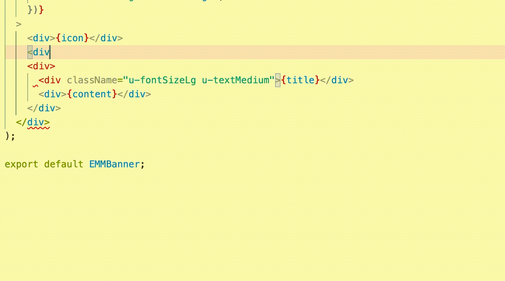

# Welcome to ReactCssAutoComplete

This tool will provide intellisense suggestions for CSS classnames defined globally as well as imported classnames.

I find myself needing this kind of tool often and couldn't find any existing ones which perfectly fit my usecase, so built my own! Publishing it in hopes someone else also finds it useful. Contributions very welcome!

The rest of this README mostly stolen from code generated during this walkthrough: https://code.visualstudio.com/api/get-started/your-first-extension

## Configuration

Currently there are two options for configuration to put into your `settings.json`:

`"reactcssautocomplete.globalCss"` - Location of globally-available CSS resources, relative to the root workspace folder.
`"reactcssautocomplete.moduleSearchPaths"` - Module search paths, relative to the root workspace folder. node_modules is a very common one, if you import CSS from there.

## What's in the folder

- This folder contains all of the files necessary for your extension.
- `package.json` - this is the manifest file in which you declare your extension and command.
  - The sample plugin registers a command and defines its title and command name. With this information VS Code can show the command in the command palette. It doesn’t yet need to load the plugin.
- `src/extension.ts` - this is the main file where you will provide the implementation of your command.
  - The file exports one function, `activate`, which is called the very first time your extension is activated (in this case by executing the command). Inside the `activate` function we call `registerCommand`.
  - We pass the function containing the implementation of the command as the second parameter to `registerCommand`.

## Get up and running straight away

- Press `F5` to open a new window with your extension loaded.
- Run your command from the command palette by pressing (`Ctrl+Shift+P` or `Cmd+Shift+P` on Mac) and typing `Hello World`.
- Set breakpoints in your code inside `src/extension.ts` to debug your extension.
- Find output from your extension in the debug console.

## Make changes

- You can relaunch the extension from the debug toolbar after changing code in `src/extension.ts`.
- You can also reload (`Ctrl+R` or `Cmd+R` on Mac) the VS Code window with your extension to load your changes.

## TODO list

- Reduce the extension size and improve the startup time by [bundling your extension](https://code.visualstudio.com/api/working-with-extensions/bundling-extension).
- Automate builds by setting up [Continuous Integration](https://code.visualstudio.com/api/working-with-extensions/continuous-integration).
- Add a linter for classnames in addition to the suggestions
- Add tests back into this (I removed them for iteration speed)
- Handle multiple folders - Currently this extension assumes it's being run from a repository with a single react app, it would be nice to segment by folder!
